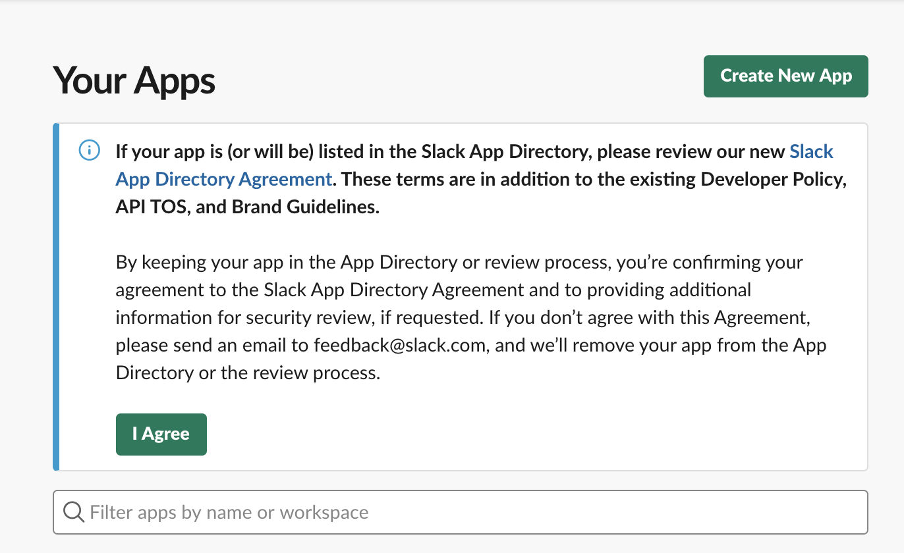
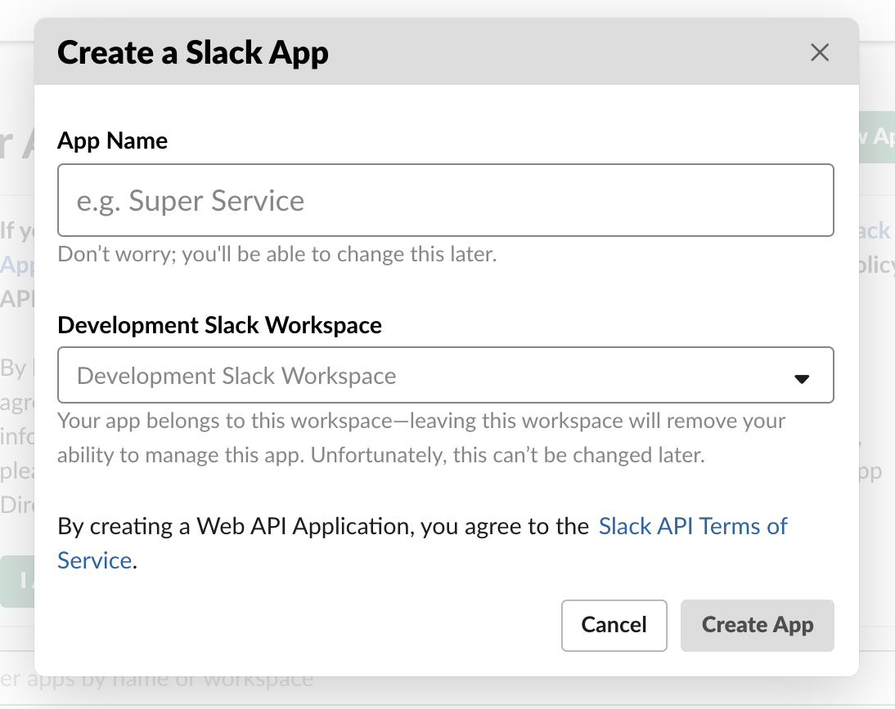
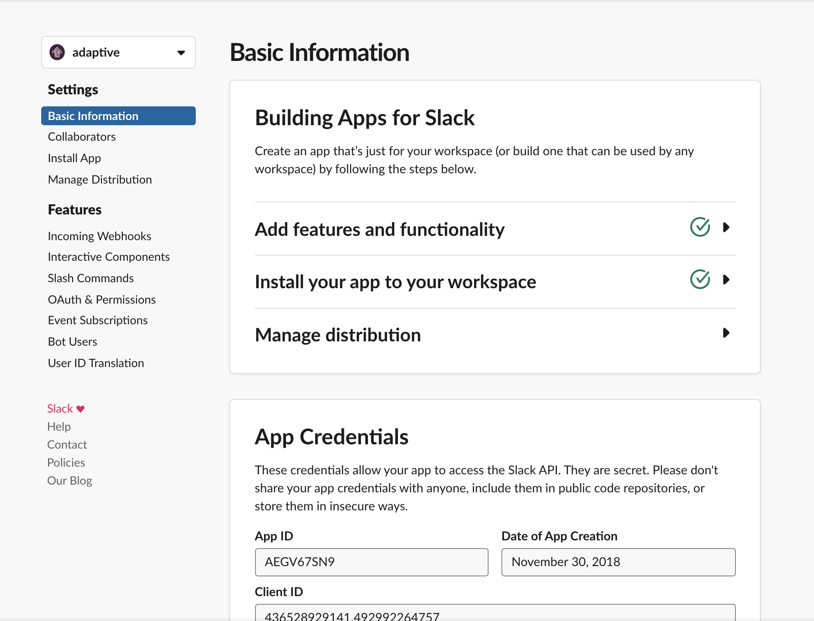
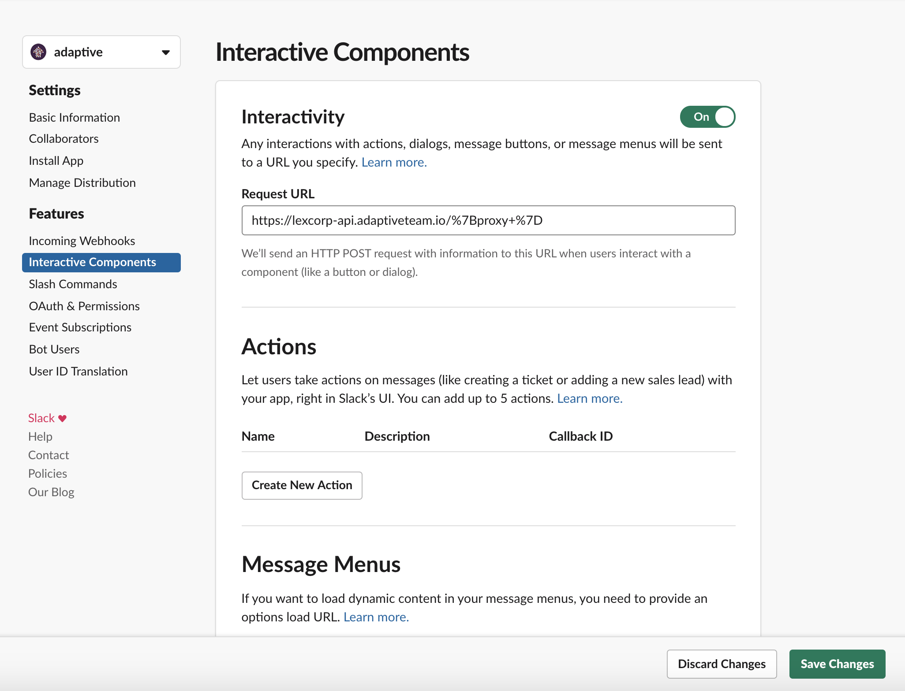
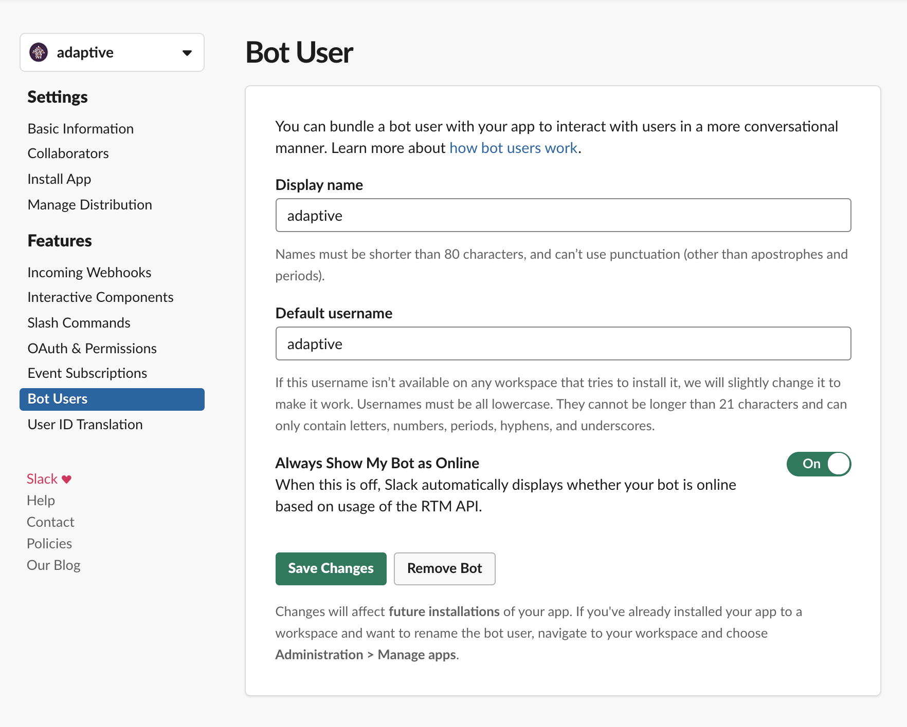
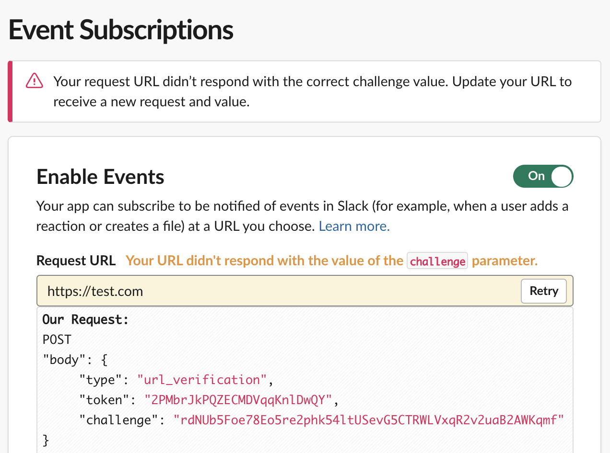
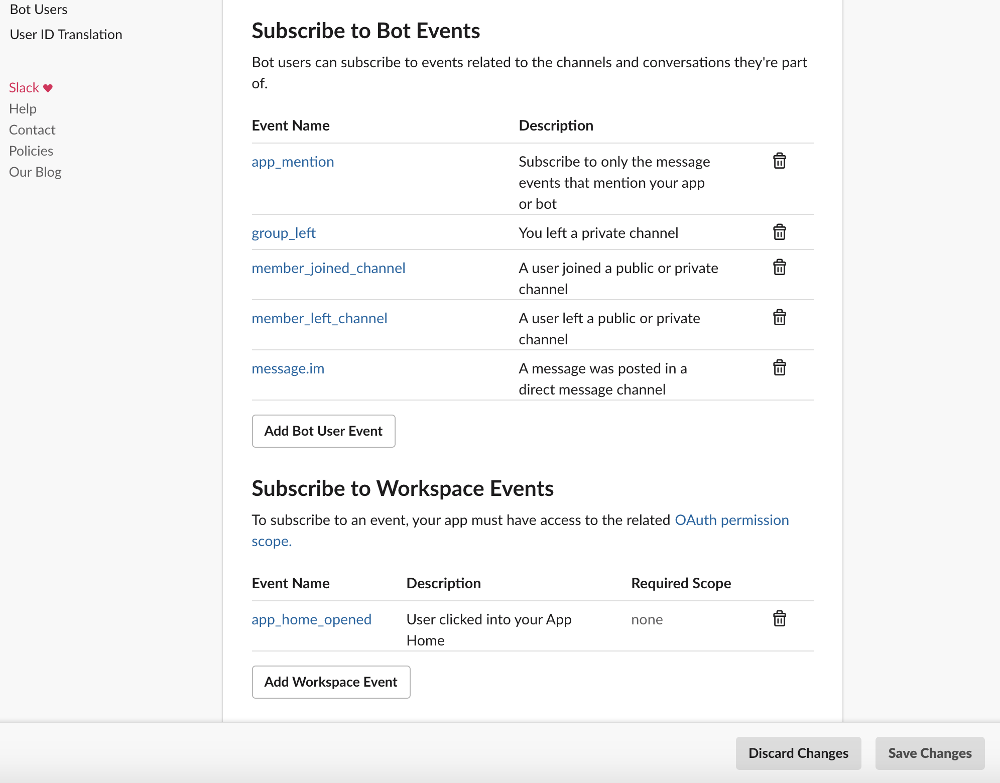
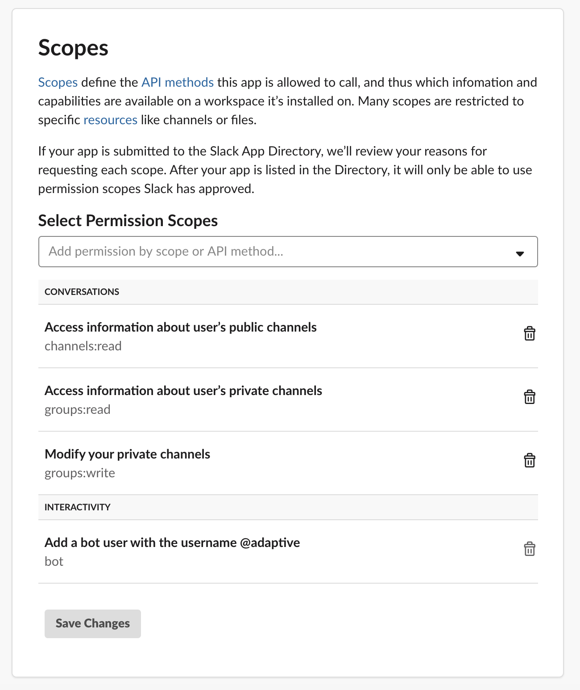

# Adaptive Installation

This document outlines the necessary steps to install Adaptive manually into a client's Slack instance.

### Slack App Setup
1. While logged into appropriate Slack account, navigate to https://api.slack.com/apps
2. Here click on `Create New App` as shown below
    - 
3. Fill in the relevant details
    -  
4. Once setup, Slack presents you with the basic details on the app
    - 
Please note the `App ID`, it will be required later
5. Next navigate to `Interactive Components` under `Features` on the left-hand side in the above image
    - Turn on `Interactivity` by clicking on the button on the left-hand side
    - Under `Request URL`, paste `https://lexcorp-api.adaptiveteam.io/%7Bproxy+%7D`
    - Save the settings by clicking on `Save Changes` towards the bottom right
    
6. Next, click on `Bot Users` on the right-hand side and add a bot with name `adaptive`
    - Click on `Save Changes`
    
7. Navigate to `Event Subscriptions`
    - Turn on `Enable Events` by clicking on the radio button on left-hand side
    - For `Request URL`, add `https://lexcorp-api.adaptiveteam.io/%7Bproxy+%7D`. If successful, you should see a green text `Verified` with a check box.
    If not you will see a message like below
    
    - Under `Subscribe to Bot Events`, select each of the following by clicking on `Add Bot User Event`
        1. `app_mention`
        2. `group_left`
        3. `member_joined_channel`
        4. `member_left_channel`
        5. `message.im`
    - Under `Subscribe to Workspace Events`, select each of the following by clicking on `Subscribe to Workspace Events`
        1. `app_home_opened`
        
        2. Save the setting by clicking on `Save Changes`
8. Navigate to `OAuth & Permissions`
    - Under `Scopes`, add the following by selecting each of them from `Select Permission Scopes` dropdown
        1. `channels:read`
        2. `groups:read`
        3. `groups:write`
        
    - Under `OAuth Tokens & Redirect URLs`, click on `Install App to Workspace`
    

Adaptive should now be in the Slack workspace

